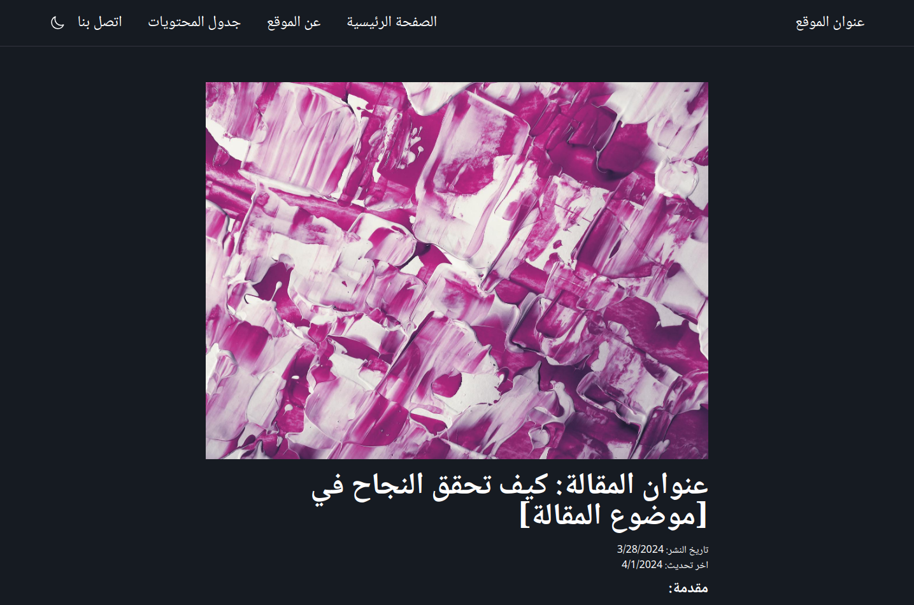

<a name="readme-top"></a>

<div align="center"></div>

<h3 align="center">Template for Arabic Content Website w/ WordPress CMS</h3>

  <p align="center">
    <br />
    <a href="https://github.com/jclark1913/arabic-wordpress-cms-react-boilerplate"><strong>View documentation »</strong></a>
    <br />
    <br />
    <a href="https://arabic-wordpress-cms-react-boilerplate.vercel.app/">View Demo</a>
  </p>
</div>

<div align="center">


</div>

<!-- TABLE OF CONTENTS -->
<details>
  <summary>Table of Contents</summary>
  <ol>
    <li>
      <a href="#about-the-project">About The Project</a>
      <ul>
        <li><a href="#built-with">Built With</a></li>
      </ul>
    </li>
    <li>
      <a href="#getting-started">Getting Started</a>
    </li>
    <li><a href="#license">License</a></li>
    <li><a href="#contact">Contact</a></li>
    <li><a href="#contributing">Contributing</a></li>
    <li><a href="#acknowledgments">Acknowledgments</a></li>
  </ol>
</details>


<!-- ABOUT THE PROJECT -->
## About The Project

This a lightweight boilerplate for an Arabic-language React website that uses WordPress.com as a CMS, originally designed to help a friend with a project. It's meant to be as beginner-friendly as possible: the only setup required is to create a Wordpress.com account and update the `VITE_WORDPRESS_SITE_URL` environmental variable.

The styling is minimal, mobile-friendly and optimized for RTL. ChatGPT helped generate articles. It's also designed around the Wordpress.com API since it is simple to use and requires no setup after making an account.

To see a hosted version, visit the <a href="https://arabic-wordpress-cms-react-boilerplate.vercel.app/">demo</a>.

<p align="right">(<a href="#readme-top">back to top</a>)</p>

### Built With

<div align="center">

![React][React]
![React Router][React Router]
![TypeScript][TypeScript]
![Vercel][Vercel]

</div>

<p align="right">(<a href="#readme-top">back to top</a>)</p>


<!-- GETTING STARTED -->
## Getting Started

### Quickstart with WordPress CMS

If you want to use this template as is with your own Wordpress.com site, follow these steps:

1. Create a Wordpress.com account
2. Clone the repo
3. Connect the repo to Vercel.com. You can follow [these directions](https://vercel.com/guides/deploying-react-with-vercel) to upload the project to Vercel.
4. Be sure to update the `VITE_WORDPRESS_SITE_URL` environmental variable with the url to your Wordpress.com site.

### Local Development
If you want to clone the repo and make changes locally, follow these steps:

1. Clone repo to your machine:

```bash
git clone https://github.com/jclark1913/arabic-wordpress-cms-react-boilerplate.git
```

2. Install dependencies

```bash
cd arabic-wordpress-cms-react-boilerplate
npm install
```

3. Run the development server

```bash
npm run dev
```

<p align="right">(<a href="#readme-top">back to top</a>)</p>


<!-- LICENSE -->
## License

Distributed under the MIT License. See `LICENSE.txt` for more information.

<p align="right">(<a href="#readme-top">back to top</a>)</p>


<!-- CONTACT -->
## Contact

Justin Clark - [@JustinClarkJO](https://twitter.com/@JustinClarkJO) - jclarksummit AT gmail DOT com

Project Link: [https://github.com/jclark1913/arabic-wordpress-cms-react-boilerplate](https://github.com/jclark1913/arabic-wordpress-cms-react-boilerplate)

<p align="right">(<a href="#readme-top">back to top</a>)</p>

## Contributing

Contributions are absolutely welcome. Open an issue or make a pull request and I'll be happy to take a look.

<!-- ACKNOWLEDGMENTS -->
## Acknowledgments

* [Best-README-Template](https://github.com/othneildrew/Best-README-Template)

<p align="right">(<a href="#readme-top">back to top</a>)</p>


<!-- MARKDOWN LINKS & IMAGES -->
<!-- https://www.markdownguide.org/basic-syntax/#reference-style-links -->
[contributors-shield]: https://img.shields.io/github/contributors/jclark1913/jobly_frontend.svg?style=for-the-badge
[contributors-url]: https://github.com/jclark1913/jobhunter/graphs/contributors
[forks-shield]: https://img.shields.io/github/forks/jclark1913/jobhunter.svg?style=for-the-badge
[forks-url]: https://github.com/jclark1913/jobhunter/network/members
[stars-shield]: https://img.shields.io/github/stars/jclark1913/jobhunter.svg?style=for-the-badge
[stars-url]: https://github.com/jclark1913/jobhunter/stargazers
[issues-shield]: https://img.shields.io/github/issues/jclark1913/jobhunter.svg?style=for-the-badge
[issues-url]: https://github.com/jclark1913/jobhunter/issues
[license-shield]: https://img.shields.io/github/license/jclark1913/jobhunter.svg?style=for-the-badge
[license-url]: https://github.com/jclark1913/jobhunter/blob/master/LICENSE.txt
[linkedin-shield]: https://img.shields.io/badge/-LinkedIn-black.svg?style=for-the-badge&logo=linkedin&colorB=555
[linkedin-url]: https://linkedin.com/in/linkedin_username
[product-screenshot]: docs/jobs.png
[React]: https://img.shields.io/badge/React-61DAFB?logo=react&logoColor=white
[React.js]: https://img.shields.io/badge/React-20232A?style=for-the-badge&logo=react&logoColor=61DAFB
[React-url]: https://reactjs.org/
[Bootstrap.com]: https://img.shields.io/badge/Bootstrap-563D7C?style=for-the-badge&logo=bootstrap&logoColor=white
[Bootstrap-url]: https://getbootstrap.com
[PostgreSQL]: https://img.shields.io/badge/PostgreSQL-4169E1?logo=postgresql&logoColor=white
[ElephantSQL]: https://img.shields.io/badge/ElephantSQL-2D9CDB?logo=elephantsql&logoColor=white
[Render]: https://img.shields.io/badge/Render-000000?logo=render&logoColor=white
[Express]: https://img.shields.io/badge/Express-000000?logo=express&logoColor=white
[Node.js]: https://img.shields.io/badge/Node.js-339933?logo=node.js&logoColor=white
[React Router]: https://img.shields.io/badge/React_Router-CA4245?logo=react-router&logoColor=white
[TypeScript]: https://img.shields.io/badge/TypeScript-3178C6?logo=typescript&logoColor=white
[TypeScript-url]: https://www.typescriptlang.org/
[Vercel]: https://img.shields.io/badge/Vercel-000000?logo=vercel&logoColor=white